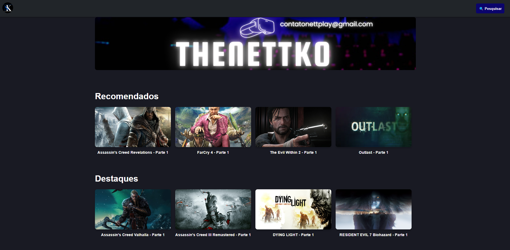

# theNettko



Bem-vindo ao **theNettko**! Este projeto é um site dedicado a fornecer informações sobre games, incluindo vídeos, notícias e atualizações relacionadas a games e programação. O **theNettko** foi criado em 2015 como um canal do YouTube, e agora estamos expandindo nosso conteúdo para incluir um site interativo que oferece uma experiência completa para entusiastas de jogos e programação.

## Funcionalidades

- **Vídeos de Games**: Exiba vídeos recentes do YouTube relacionados ao canal de jogos.
- **Notícias sobre Games**: Mantenha-se atualizado com as últimas notícias e novidades no mundo dos games.
- **Podcasts sobre Games e Programação**: Ouça podcasts informativos sobre games e programação para expandir seu conhecimento e ficar por dentro das tendências do setor.
- **Sistema de Membros**: Usuários cadastrados na plataforma podem receber notificações de novidades e atualizações.
- **Sistema de Login**: Gerencie o acesso dos usuários com funcionalidades de login e autenticação.

## Tecnologias Utilizadas

- **Frontend**: React
<!-- - **API**: YouTube Data API v3 -->

## Requisitos

- **Node.js**: Versão 14.x ou superior
- **NPM**: Versão 6.x ou superior

<!-- ## Configuração do Ambiente

Para configurar o projeto localmente, siga as instruções abaixo:

## Configuração

Para configurar o projeto, você precisará de um arquivo `.env` com as seguintes variáveis de ambiente:

1. **Crie um arquivo `.env` na raiz do projeto.**
2. **Adicione as seguintes variáveis de ambiente ao arquivo `.env`:**

   ```plaintext
   REACT_APP_YOUTUBE_API_KEY=YOUR_API_KEY
   REACT_APP_YOUTUBE_CHANNEL_ID=YOUR_CHANNEL_ID
   ```

### 1. Clonar o Repositório

Clone este repositório para o seu ambiente local:

```bash
git clone https://github.com/seu-usuario/the-nettko.git
cd the-nettko
```

### 2. Configurar Variáveis de Ambiente

Para configurar o projeto, você precisará de um arquivo .env com as seguintes variáveis de ambiente:

1. Crie um arquivo .env na raiz do projeto.

2. Adicione as seguintes variáveis de ambiente ao arquivo .env:

Clone este repositório para o seu ambiente local:

```
REACT_APP_YOUTUBE_API_KEY=YOUR_API_KEY
REACT_APP_YOUTUBE_CHANNEL_ID=YOUR_CHANNEL_ID
```
Substitua YOUR_API_KEY pela sua chave da API do YouTube e YOUR_CHANNEL_ID pelo ID do seu canal do YouTube. -->

### 3. Instalar Dependências

Instale as dependências do projeto usando NPM:

```
npm install
```

### 4. Rodar o Projeto

Inicie o servidor de desenvolvimento para ver o projeto em funcionamento:

```
npm start
```

A aplicação estará disponível em http://localhost:3000.

<!--**Contribuindo**

_Se você deseja contribuir para o projeto, sinta-se à vontade para fazer um fork do repositório e enviar pull requests. Certifique-se de seguir as boas práticas de desenvolvimento e fornecer uma descrição clara das alterações feitas._

**Licença**

_Este projeto está licenciado sob a Licença MIT._

_Se você tiver alguma dúvida ou problema, não hesite em abrir uma issue no GitHub ou entrar em contato com o mantenedor do projeto._

**_Obrigado por usar o theNettko!_** -->
